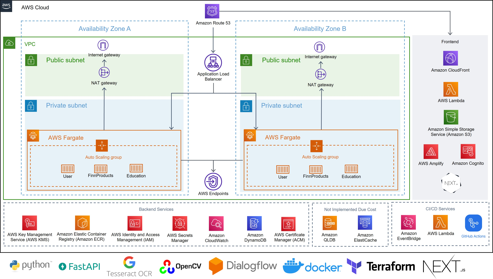

# gs-hack-beyondintelli

## Introduction

### What is Maverick?

Maverick is a one-stop solution for individuals to learn more about financial concepts, as well as the various financial products available, such as loans, credit cards or stocks. Within Maverick, users can find personalised recommendations for various financial products, based on their financial profile. By providing curated recommendations and key information, users can find suitable products, check their eligibility, and get verified for these products within a single platform, streamlining the decision-making process.

Maverick also provides a platform for banks to get access to verified e-KYC of customers that have been verified by our system. This saves the bank time and money as they do not need to carry out these basic checks on applicants which they might be unwilling to do for services such as micro-loans.

[Experience Maverick Here!](https://gs-maverick-finance.tech/home)

### Objectives

- Improve financial literacy of underbanked individuals
- Simplify the decision-making process in engaging financial services

## Key Features

- Automated eKYC process powered by machine learning
- Financial Planner
- Microloans Application
- Education Resources
- Ask Maverick! (Chatbot for common queries)

## Technicals

### AWS Architecture

### Key Benefits

Maverick uses a highly scalable microservice backend powered by ECS Fargate to ensure high availability. They are containerized using Docker, deployed across Availability Zones within the private subnet of the VPC. Access to the APIs is provided via an Application Load Balancer and the services auto-scale based on the volume of requests received. The microservices are developed using Python with FastAPI. The machine learning module for e-KYC is powered by OpenCV with Google Tesseract.

The web application is built using the NextJS framework and deployed onto CloudFront using Amplify. The pages are rendered server-side with authentication checks done by Amplify during the server-side rendering. Both the web application and API backend are secured by Cognito for identity management.

For persistance, DyanmoDB is used with the read/write capacity auto-scaling as needed to meet the requests of the application. DynamoDB also allows for the information within the database to be encrypted at rest. Due to cost consideration, the proposed AWS QLDB for tracking of e-KYC transactions was not implemented.

To secure our application, API keys for the backend are stored as secrets and injected into the container at runtime for security. Access to the Secrets Manager and DynamoDB is provided by the VPC endpoint inside the private subnet and access for each service is controlled by IAM roles.

For deployment, our code is deployed to the cloud using CI/CD pipelines built using Github Actions. The infrastructure is written as Infrastructure-As-Code using Terraform allowing for the infrstructure to be easily edited and deployed.

## Dependencies

### Frontend

- NextJS
- Chakra UI
- Google Dialogflow

### Backend

- Python
- FastAPI
- Uvicorn
- Poetry
- FinnHub
- Boto3
- News-Api
- PyTesseract
- OpenCV
- Google Tesseract

### Infrastructure as Code

- Terraform

## Future Integrations

### e-KYC-as-a-service using AWS Quantum Ledger

The use of AWS QLDB will allow for immutable storage and a clear audit trail for all e-KYC requests. Banks and other financial companies will be able to programmatically request for an e-KYC verification from our platform. This allows them to easily authenticate poential borrwers and card holders, giving a larger group of people easy access to finance.

### User Analytics

As more user data is collected, analytics can be done to identify trends as well as to improve the e-KYC risk analysis model that is shared with banks. This analytics benefits users as they can have access to a wider variety of tailored financial services that meets their needs.

### Enhance chatbot experience

As more users chat with the chat bot, we will be able to identify where we are lacking and train the chatbot to be able to generate replies to those queries. This data also provides us greater insight on the user's needs.
